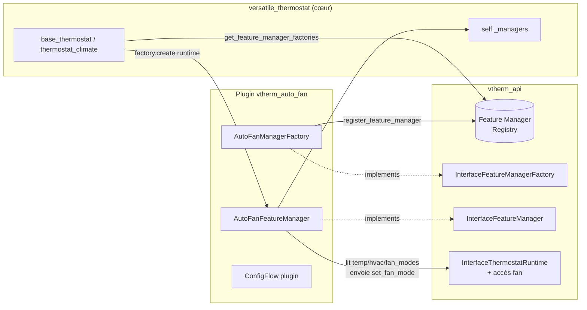

# Plan technique — Migration de `auto-fan` vers un plugin (mécanisme Feature Manager externe)

Ce document décrit le plan complet pour transformer la fonctionnalité **auto-fan**, aujourd'hui codée en dur dans le cœur `versatile_thermostat`, en une **feature packagée sous forme de plugin externe**.

Il sert de référence de travail partagée entre les deux dépôts impliqués :
- `vtherm-api` (le contrat/API partagé — **point de départ des travaux**)
- `versatile_thermostat` (le cœur)
- `vtherm_auto_fan_extended` (le nouveau plugin — **créé**, nommé pour correspondre au dépôt)

L'objectif secondaire est de **définir un mécanisme générique de "Feature Manager externe"** qui servira de modèle pour extraire d'autres feature managers vers des plugins.

> **Stratégie retenue : Option A** — introduction d'une *Feature Manager Factory* dans `vtherm-api`, chargée dynamiquement par le cœur et instanciée par thermostat. Ce mécanisme est calqué sur celui déjà existant des *Proportional Algorithm Factory* (utilisé par `hysteresis`, `smartpi`, `pellet`).

---

## 0. État courant de la session (mémo de reprise)

> Section mémo mise à jour au fil de l'avancement. Résume l'état réel des trois dépôts et le reste-à-faire.

### 0.1 Avancement global

| Phase | Dépôt | État | Détail |
| ----- | ----- | ---- | ------ |
| Phase 1 — Contrat/API | `vtherm_api` | ✅ **Fait** (v `0.4.0`) | `InterfaceFeatureManagerFactory` (`name`, `supports(thermostat)`, `create(thermostat)`), registre (`register/unregister/get/list_feature_managers`, `get_feature_manager_factories`), `InterfaceThermostatRuntime` étendu (temp régulée/cible/courante, `vtherm_hvac_mode`, `underlying_fan_modes`, `async_set_underlying_fan_mode`, …). |
| Phase 2 — Cœur | `versatile_thermostat` | 🟡 **Partiel** | Chargement des managers externes en place (`_load_external_feature_managers`, `_external_manager_names`, retry au startup). **Reste** : refresh par cycle des managers externes + service de compat `set_auto_fan_mode`. Voir §0.4. |
| Phase 3 — Plugin (parité legacy) | `vtherm_auto_fan_extended` | ✅ **Fait & validé (tests réels)** | Logique métier legacy portée. Refresh par cycle branché sur `refresh_state` (cœur), hook autonome retiré, self-heal du mapping ajouté, logs debug ajoutés. Tests exécutés en local (12 passed). Voir §0.5. |
| Phase 4 — Plugin (nouvelle fonction par seuils) | `vtherm_auto_fan_extended` | 🔜 **À développer** | Pivot vers l'approche **seuil par `fan_mode`** (entités `number`/`select`/`switch`), qui remplace le mapping figé et gère les `fan_modes` non normalisés. Spec : [`specifications-fr.md`](./specifications-fr.md). Voir §0.6. |

### 0.2 Décisions figées

- **Nom du plugin / domaine** : `vtherm_auto_fan_extended` (aligné sur le dépôt).
- **Nom logique du feature manager (factory `name` + `manager.name`)** : `auto_fan` (**inchangé**). Le cœur doit dispatcher sur ce nom.
- **Service historique** : `versatile_thermostat.set_auto_fan_mode` doit être **conservé dans le cœur** pour compat ascendante (valeurs historiques `None|Low|Medium|High|Turbo`). Le service temporaire du domaine plugin sera retiré ensuite.
- **Refresh par cycle** : piloté **par le cœur** (boucle sur les managers **externes** uniquement), pas par un hook autonome du plugin.
- **Nouvelle direction fonctionnelle (Phase 4)** : abandon du mapping figé `none/low/medium/high/turbo` au profit d'un **seuil de déclenchement par `fan_mode`** piloté par l'utilisateur (entités `number` de seuil, `select` mode de repos, `switch` d'activation). Objectif : supporter les `fan_modes` non normalisés (ex. `on_low/on_high/auto_low/auto_high/off`). Détail complet dans [`specifications-fr.md`](./specifications-fr.md).

### 0.3 Contrainte d'environnement

~~Aucune installation HA dans les venv locaux~~ → **résolu**. Un `.venv` local est désormais opérationnel : **Python 3.14.7** (Homebrew) + **Home Assistant 2026.8.2** + `vtherm_api`, `pytest`, `pytest-asyncio`, `voluptuous`. `pytest` s'exécute en local (**12 passed**).

> Note : `pymicro_vad` (dépendance audio de HA listée dans `requirements_dev.txt`) ne compile pas sous Python 3.14 ; elle est inutile aux tests du plugin et volontairement non installée. Installer donc `homeassistant` seul plutôt que `-r requirements_test.txt` en entier.

### 0.4 Reste-à-faire — CŒUR (`versatile_thermostat`, branche `feat_autofan_manager_plugin`)

**Change A — Refresh des managers externes à chaque cycle** (`base_thermostat.py`) :
1. `__init__` : ajouter `self._external_managers: list[BaseFeatureManager] = []` près de `self._external_manager_names`.
2. `_load_external_feature_managers()` : après `self.register_manager(manager)`, ajouter `self._external_managers.append(manager)`.
3. `async_control_heating()` : après `await self._control_heating_specific(timestamp, force)`, boucler `for manager in self._external_managers: await manager.refresh_state()` (try/except par manager).
> ⚠️ Ne pas boucler sur **tous** `self._managers` : les managers internes ont déjà leurs propres déclencheurs.

**Change B — Service de compat `versatile_thermostat.set_auto_fan_mode`** :
- Ré-enregistrer le service entité dans `climate.py` (schéma historique `None|Low|Medium|High|Turbo`).
- Ajouter sur `base_thermostat` une méthode générique (ex. `async def service_set_auto_fan_mode(self, auto_fan_mode)`) qui trouve le manager externe `name == "auto_fan"` dans `self._managers` et appelle `await manager.async_set_auto_fan_mode(auto_fan_mode)` (le manager accepte déjà les valeurs humaines) ; warning si plugin absent.
- Réintroduire `SERVICE_SET_AUTO_FAN_MODE = "set_auto_fan_mode"` (const) + entrée `services.yaml`.
- Référence historique : commit `13608cd` (`thermostat_climate.py` L1232-1255, `climate.py` L121-130, `const.py` L429, `CONF_AUTO_FAN_*` L117-122).

### 0.5 Reste-à-faire — PLUGIN (`vtherm_auto_fan_extended`, parité legacy)

- ✅ Retrait du **hook autonome** de `manager.start_listening()` (abonnement `async_track_state_change_event` sur l'entité VTherm) — supprimait le double-envoi (par cycle + par changement d'état). `refresh_state()` est l'unique point d'entrée cycle.
- ✅ **Self-heal du mapping** : `refresh_state()` relance `choose_auto_fan_mode()` tant que `_auto_activated_fan_mode` est `None` (cas où le sous-jacent n'a pas encore publié ses `fan_modes` au démarrage).
- ✅ **Logs debug** ajoutés dans `choose_auto_fan_mode()` (valeurs `fan_modes`, `speed_modes`, `target_index`, court-circuits).
- ⏳ Retirer le **service temporaire** `vtherm_auto_fan_extended.set_auto_fan_mode` (+ `services.yaml`) une fois Change B livré côté cœur.

### 0.6 Reste-à-faire — PLUGIN (nouvelle fonction par seuils, Phase 4)

Référence : [`specifications-fr.md`](./specifications-fr.md). Le mapping figé legacy est remplacé par une configuration par seuils. **Step 1** à implémenter :

- Ajouter les plateformes d'entités **`number`** (un seuil par `fan_mode`), **`select`** (mode de repos), **`switch`** (activation auto-fan), créées par VTherm pour chaque `over_climate` éligible.
- Câbler **manager ↔ entités** : le manager lit seuils / repos / état du switch ; les entités notifient le manager à chaque changement.
- Remplacer `choose_auto_fan_mode`/`_send_auto_fan_mode` par le nouvel **algorithme de sélection** (plus grand seuil `≤ |écart|`, sinon repos ; garde-fou cohérence chaud/froid ; envoi seulement si changement).
- `number` : `RestoreNumber`, `EntityCategory.CONFIG`, `min=0`, `step=0.1`, `max` raisonnable, unité `°C`/`°F` selon `hass.config.units`. Convention **seuil `0` = « ne participe pas »**.
- Conserver `write_event_log` sur chaque changement de `fan_mode`.
- Tests unitaires du nouvel algorithme (sélection, repos, cohérence hvac, cas limites).
- Steps 2 et 3 (anti-oscillation ; forçage temporaire par service, profils chaud/froid, mode « sleep ») : voir la spec, hors périmètre immédiat.

---

## 1. État actuel de `auto-fan` (cœur)

Auto-fan est **entièrement intégré** dans `ThermostatOverClimate` (aucun feature manager), et **spécifique à `over_climate`** car il a besoin des `fan_modes` du climate sous-jacent.

| Élément                                                                                                       | Emplacement                                                                       |
| ------------------------------------------------------------------------------------------------------------- | --------------------------------------------------------------------------------- |
| Constantes (`CONF_AUTO_FAN_MODE`, niveaux `none/low/medium/high/turbo`, seuil `±2°C`, modes de désactivation) | `const.py` L121-126, L462-467, L492, L525-526, L393                               |
| Option ConfigFlow (`default=auto_fan_high`)                                                                   | `config_schema.py` L244-247                                                       |
| Variables d'état                                                                                              | `thermostat_climate.py` L60-64                                                    |
| Init depuis la config                                                                                         | `thermostat_climate.py` L117-120                                                  |
| Logique d'envoi (`_send_auto_fan_mode`)                                                                       | `thermostat_climate.py` L331-374                                                  |
| Mapping niveaux → vitesses réelles (`choose_auto_fan_mode`)                                                   | `thermostat_climate.py` L448-568                                                  |
| Appel dans le cycle                                                                                           | `thermostat_climate.py` L871-872                                                  |
| Attributs exposés                                                                                             | `thermostat_climate.py` L625-626                                                  |
| Propriété `auto_fan_mode`                                                                                     | `thermostat_climate.py` L997-999                                                  |
| Service `set_auto_fan_mode` (logique)                                                                         | `thermostat_climate.py` L1282-1308                                                |
| Désactivation forcée (régulation par vanne)                                                                   | `thermostat_climate_valve.py` L450-452                                            |
| Envoi au sous-jacent (`set_fan_mode`, gestion délai issue #1458)                                              | `underlyings.py` L761-801                                                         |
| Enregistrement du service HA                                                                                  | `climate.py` L121-130                                                             |
| Traductions                                                                                                   | `translations/fr.json` L114,131,804-810 ; `translations/en.json` L113,130,802-808 |
| Tests                                                                                                         | `tests/test_auto_fan_mode.py`                                                     |

### Logique métier (résumé factuel)
1. À l'init, `_auto_fan_mode` est lu depuis la config (`auto_fan_none` par défaut runtime).
2. Après init des underlyings, `choose_auto_fan_mode()` mappe le niveau choisi vers un `fan_mode` réel du climate sous-jacent (`_auto_activated_fan_mode`) et un `fan_mode` de désactivation (`_auto_deactivated_fan_mode`), en s'adaptant au nombre de vitesses disponibles.
3. À chaque cycle, `_send_auto_fan_mode()` calcule l'écart `dtemp = cible − courante`. Si `|dtemp| ≥ 2°C` **et** cohérent avec le `hvac_mode`, il envoie `_auto_activated_fan_mode` au sous-jacent, sinon `_auto_deactivated_fan_mode`.
4. Le service `set_auto_fan_mode` permet de changer le niveau à chaud.
5. En régulation par vanne, l'auto-fan est toujours désactivé.

---

## 2. Mécanisme de plugin actuel (`vtherm_api` 0.3.0)

Deux points d'extension existent réellement :

1. **Proportional Algorithm Factory** — `InterfacePropAlgorithmFactory` / `InterfacePropAlgorithmHandler`.
   - Registre côté API : `register_prop_algorithm` / `unregister_prop_algorithm` / `get_prop_algorithm` / `list_prop_algorithms`.
   - Le cœur instancie **un handler par thermostat** via `factory.create(thermostat_runtime)`.
   - Utilisé par `hysteresis`, `smartpi`, `pellet`.

2. **PluginClimate (event-based)** — `register_manager` / `link_to_vtherm` + `PluginClimate`.
   - Écoute les events VTherm (`TEMPERATURE_EVENT`, `HVAC_MODE_EVENT`, …) et agit via `call_linked_vtherm_action()`.
   - Utilisé par `climate_replication`.

### Lacune identifiée (fait vérifié)
Il **n'existe pas** de mécanisme *Feature Manager Factory par thermostat*. `VThermAPI.register_manager()` enregistre **une seule instance** sur les `PluginClimate` **déjà existants** ; il ne gère ni l'instanciation par VTherm, ni les VTherm futurs, ni l'activation par configuration, ni le scope `over_climate`, ni la restauration d'état.

De plus, `InterfaceThermostatRuntime` **n'expose ni les underlyings, ni `fan_modes`, ni `set_fan_mode`** — nécessaires à auto-fan.

C'est précisément ce que l'**Option A** vient combler.

---

## 3. Architecture cible (Option A)

Introduire un mécanisme **Feature Manager Factory** symétrique aux Proportional Algorithm Factory :

- Un plugin enregistre une **factory** de feature manager auprès de l'API.
- Le cœur, à la construction de chaque thermostat éligible, interroge l'API, instancie **un manager par thermostat** via `factory.create(runtime)`, et l'ajoute à `self._managers`.
- Le manager externe bénéficie alors **automatiquement** des boucles de cycle existantes (`post_init`, `start_listening`, `refresh_state`, `stop_listening`, `restore_state`), car il implémente `InterfaceFeatureManager`.
- L'interface runtime est étendue pour donner au manager l'accès nécessaire (température régulée/cible/courante, `hvac_mode`, `fan_modes` du sous-jacent, envoi d'un `fan_mode`).



---

## 4. Phase 1 — `vtherm-api` (point de départ)

Objectif : livrer le contrat sur lequel s'appuieront ensuite le cœur et le plugin.

### 4.1 Nouvelle interface `InterfaceFeatureManagerFactory`
Symétrique à `InterfacePropAlgorithmFactory` :
- Propriété `name: str` → identifiant unique du feature manager (ex. `auto_fan`).
- Méthode `create(thermostat: InterfaceThermostatRuntime) -> InterfaceFeatureManager`.
- (Optionnel) Propriété/méthode indiquant le **scope** d'éligibilité (ex. `over_climate` uniquement), afin que le cœur n'instancie pas le manager sur des thermostats incompatibles. À définir : soit un attribut sur la factory, soit une vérification déléguée (`supports(runtime) -> bool`).

### 4.2 Registre dans `VThermAPI`
Ajouter, calqués sur les prop-algos :
- `register_feature_manager(factory)`
- `unregister_feature_manager(name)`
- `get_feature_manager(name)`
- `list_feature_managers() -> list[str]`
- `get_feature_manager_factories() -> list[InterfaceFeatureManagerFactory]` (le cœur en a besoin pour itérer à la création d'un thermostat).

> Décision : conserver l'ancien `register_manager` (PluginClimate) intact pour ne pas casser `climate_replication`. Le nouveau registre est **distinct**.

### 4.3 Extension de `InterfaceThermostatRuntime`
Auto-fan a besoin d'accéder au sous-jacent. Ajouter (a minima) :
- `regulated_target_temperature` (ou exposer la température de consigne régulée déjà utilisée par `_send_auto_fan_mode`).
- Accès aux `fan_modes` du/des climate(s) sous-jacent(s).
- Une méthode d'envoi d'un `fan_mode` au sous-jacent (`async_set_underlying_fan_mode(fan_mode)` ou équivalent), pour réutiliser la logique de délai existante d'`underlyings.set_fan_mode` (issue #1458).

> Point à trancher : exposer directement les underlyings (plus générique, utile pour de futurs managers) **ou** n'exposer que les 2-3 accès dont auto-fan a besoin (plus fermé, plus sûr). Recommandation : exposer un accès minimal et typé au fan (modes + envoi), plus l'éventuel besoin générique dans une itération ultérieure.

### 4.4 Confirmation du contrat `InterfaceFeatureManager`
Le contrat existe déjà (`post_init`, `start_listening`, `stop_listening`, `refresh_state`, `restore_state`, `is_configured`, `is_detected`, `name`, `hass`). Vérifier qu'il couvre le cycle de vie d'auto-fan ; sinon compléter (ex. hook explicite appelé à chaque cycle si `refresh_state` ne suffit pas).

### 4.5 Versionnement
- Bump de version `vtherm_api` (ex. `0.4.0`).
- Le cœur devra relever la contrainte dans `manifest.json` et `requirements_dev.txt` / `requirements_test.txt`.

### 4.6 Tests `vtherm-api`
- Tests unitaires du registre (register/unregister/get/list).
- Tests du contrat de factory (`create`), du scope, et de l'extension runtime.

---

## 5. Phase 2 — Cœur `versatile_thermostat`

### 5.1 Retraits (extraction de l'auto-fan)
- `config_schema.py` L244-247 (option ConfigFlow).
- `thermostat_climate.py` : variables L60-64, init L117-120, `_send_auto_fan_mode` L331-374, `choose_auto_fan_mode` L448-568, appel cycle L871-872, attributs L625-626, propriété L997-999, `service_set_auto_fan_mode` L1282-1308.
- `thermostat_climate_valve.py` L450-452 (override).
- `climate.py` L121-130 (enregistrement du service).
- `const.py` : constantes auto-fan (L121-126, L462-467, L492, L525-526, retrait de `CONF_AUTO_FAN_MODE` de `DEFAULT_SCHEMA` L393).
- `translations/fr.json` et `en.json` : entrées auto-fan.
- Déplacer `tests/test_auto_fan_mode.py` vers le plugin.

> À conserver : `underlyings.set_fan_mode` (L761-801) fait partie de l'API climate générique (utilisé aussi hors auto-fan). Il sera réutilisé via l'extension runtime de la Phase 1.

### 5.2 Ajouts (support des feature managers externes)
- Au point de construction du thermostat (`base_thermostat` / spécifiquement `thermostat_climate` pour un manager `over_climate`), après l'instanciation des managers internes :
  - interroger l'API (`get_feature_manager_factories`),
  - pour chaque factory éligible au thermostat (scope), `factory.create(self)` puis `self.register_manager(...)`.
- Gérer le cas « factory pas encore enregistrée au moment de la construction » (plugin chargé plus tard), en s'inspirant du **retry au startup** déjà fait pour les prop-algos.
- Implémenter les propriétés/méthodes ajoutées à `InterfaceThermostatRuntime` (accès fan, température régulée).

### 5.3 Compatibilité recorder / attributs
Auto-fan exposait `auto_fan_mode`, `current_auto_fan_mode`, `auto_activated_fan_mode`, `auto_deactivated_fan_mode`. Désormais ces attributs sont fournis par le **manager du plugin**, regroupés sous une **section top-level dédiée** (cf. règle recorder : seuls les clés top-level sont filtrables). Déclarer cette section dans `unrecorded_attributes` du manager si besoin.

---

## 6. Phase 3 — Nouveau plugin `vtherm_auto_fan`

Structure calquée sur `vtherm_hysteresis` / `vtherm_smartpi` :

```
custom_components/vtherm_auto_fan/
  __init__.py         # async_setup / async_setup_entry -> register factory ; unload -> unregister
  manifest.json       # domain, after_dependencies: [versatile_thermostat], dep vtherm_api
  const.py            # niveaux, seuil, modes de désactivation
  factory.py          # AutoFanManagerFactory (name="auto_fan", create(), scope over_climate)
  manager.py          # AutoFanFeatureManager (mapping vitesses, seuil, activation, restore, attrs)
  config_flow.py      # sélection VTherm cible + niveau, defaults globaux
  services.yaml       # service set_auto_fan_mode
  strings.json
  translations/       # fr.json, en.json
  tests/              # depuis test_auto_fan_mode.py
```

Comportement du manager :
- `post_init` : lit la config (niveau) applicable au VTherm.
- Après init des underlyings : calcule le mapping vitesses (`choose_auto_fan_mode`).
- À chaque cycle (`refresh_state` ou hook cycle) : applique `_send_auto_fan_mode` via l'accès fan de l'interface runtime.
- Service `set_auto_fan_mode` : re-mappe et met à jour les attributs.
- `restore_state` : restaure le niveau courant.

---

## 7. Migration / compatibilité utilisateur

Les VTherm existants possèdent `auto_fan_mode` dans leur config entry. Options :
- **Migration assistée** : le plugin lit l'ancienne clé `auto_fan_mode` présente dans l'entry du VTherm cible pour pré-remplir sa configuration.
- **Reconfiguration manuelle** : documentée dans le README du plugin.

> Décision à confirmer avec le mainteneur.

---

## 8. Séquencement des travaux

1. **`vtherm-api`** (container dédié) : interface factory + registre + extension runtime + tests + version.
2. **Cœur** : retraits auto-fan + point de chargement des managers externes + implémentation des accès runtime + màj contrainte `vtherm_api` + nettoyage traductions.
3. **Plugin** : implémentation + config flow + service + traductions + tests migrés.
4. **Docs** : README du plugin, mise à jour doc VTherm (retrait auto-fan du cœur), lien vers ce plan.

---

## 9. Points ouverts / décisions

| Sujet | État | Décision |
| ----- | ---- | -------- |
| Mécanisme de **scope** de la factory | ✅ Tranché | `supports(thermostat)` sur la factory (True si `thermostat_type == over_climate`, fallback `underlying_fan_modes` non nul). |
| Étendue de l'extension runtime | ✅ Tranché | Accès fan minimal + température régulée/cible/courante + `vtherm_hvac_mode` (implémenté en `vtherm_api` 0.4.0). |
| **Migration** des configs existantes | 🟡 Partiel | Le manager lit l'ancienne clé `auto_fan_mode` de l'entry VTherm en fallback (`_resolve_level`). Migration auto vs manuelle à confirmer avec le mainteneur. |
| Domaine du plugin | ✅ Tranché | `vtherm_auto_fan_extended` (aligné dépôt). |
| Domaine du **service** | ✅ Tranché | Historique `versatile_thermostat.set_auto_fan_mode` conservé dans le cœur (Change B). Service domaine plugin = temporaire, à retirer. |
| **Nom logique** du feature manager | ✅ Tranché | `auto_fan` (inchangé) — le dispatch cœur doit matcher ce nom. |
| **Hook de cycle** explicite dans le contrat ? | ✅ Tranché | Pas de nouveau hook : le cœur boucle `refresh_state()` sur les managers externes à chaque cycle (Change A). |
