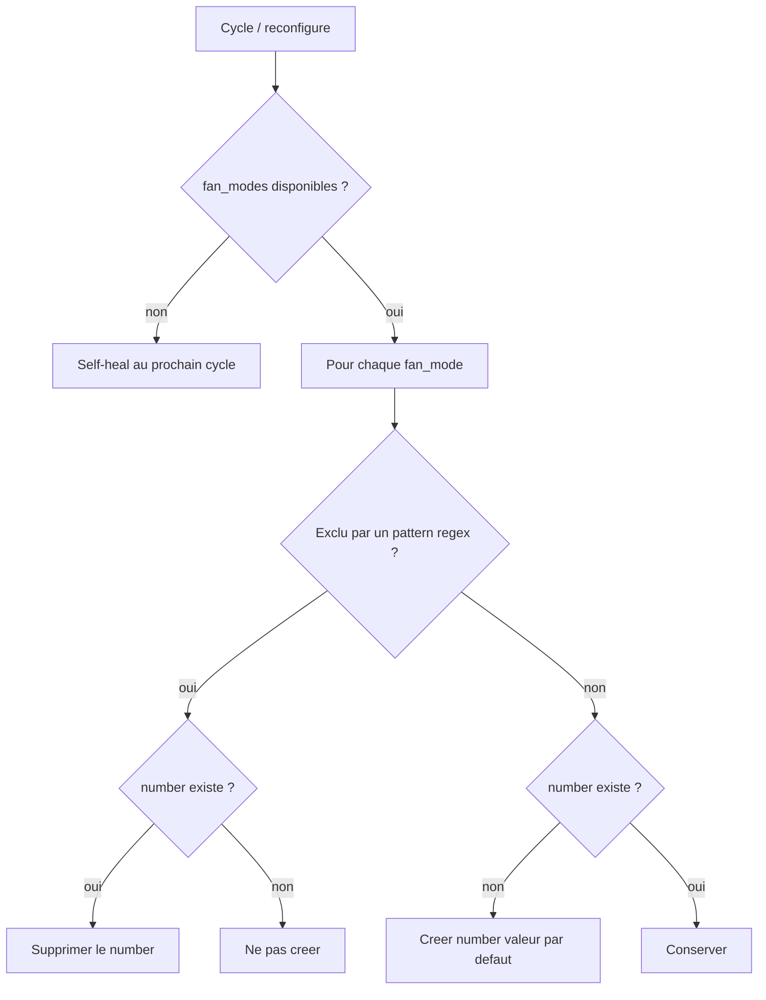

# Contenu
Ce fichier contient les spécifications du plugin `vtherm_auto_fan_extended`. Ce plugin est un plugin pour l'intégration `Versatile Thermostat` qui vise à fournir une intégration de thermostat connecté pour Home Assistant.

# Problème à résoudre
Les intégrations de type `climate` dans Home Assistant possèdent des fonctions pour changer le fan mode. La liste des `fan_modes` possibles est définie par un attribut du `climate` nommé `fan_modes`.
La difficulté est que cette liste de `fan_modes` n'est pas normalisée. Certains équipements peuvent avoir cette liste de valeurs possibles :
```
fan_modes:
  - auto
  - quiet
  - low
  - medlow
  - medium
  - medhigh
  - high
  - turbo
```

d'autres :
```
fan_modes:
  - on_low
  - on_high
  - auto_low
  - auto_high
  - "off"
```

Tout est possible et ça rend la fonction d'auto-fan-mode délicate à implémenter.

Pour rappel, la fonction `auto-fan` de `VTherm` permet d'adapter automatiquement le niveau de puissance du ventilateur d'un équipement en fonction de l'écart entre la consigne et la température réelle. L'objectif étant de brasser l'air plus fort si l'écart est important afin d'optimiser la durée d'alignement de ces températures.

La version historique (codée en dur dans le cœur) reposait sur un mapping figé (`none/low/medium/high/turbo` → indices de vitesse). Ce mapping suppose que la liste `fan_modes` contient des valeurs de vitesse reconnaissables (`low`, `1`, …) ordonnées. Il échoue sur les équipements dont les `fan_modes` ne suivent pas cette convention (ex. `on_low`, `on_high`, `auto_low`, `auto_high`, `off`).

# Proposition de solution
Le principe retenu abandonne le mapping figé au profit d'un **seuil de déclenchement par `fan_mode`**, piloté par l'utilisateur. C'est l'utilisateur — qui connaît son matériel — qui déclare quel `fan_mode` correspond à quel niveau de brassage, en lui associant un écart de température à partir duquel il doit s'activer.

## Step 1 — Cœur de la fonction

### Modèle de données (entités créées par VTherm)

Pour chaque `VTherm` éligible (scope `over_climate` exposant des `fan_modes`), le plugin crée les entités suivantes :

1. **Un `number` de seuil par `fan_mode` participant.**
   - Nommage : `number.<vtherm>_fan_mode_threshold_<fan_mode>` (ou approchant, après slug des caractères spéciaux).
   - **Créé uniquement pour les `fan_modes` participants** : les modes matchés par la liste d'expressions régulières d'exclusion (voir §Configuration) n'ont **pas** de `number`. Cela évite de créer des seuils absurdes pour des modes comme `off`, `auto`, `quiet`.
   - Représente l'écart de température (`|consigne régulée − température pièce|`) à partir duquel ce `fan_mode` devient candidat.
   - Caractéristiques : `RestoreNumber` (survit au redémarrage), `EntityCategory.CONFIG`, `min=0`, `step=0.1`, `max` raisonnable (ex. 10).
   - **Unité** : `°C` ou `°F` selon la configuration de l'utilisateur (`hass.config.units`).
   - **Convention `seuil = 0`** sur un `number` créé : l'utilisateur retire ce `fan_mode` des niveaux d'activation sans supprimer l'entité (il n'est jamais choisi comme niveau d'activation).

2. **Un `select` « mode de repos ».**
   - Désigne le `fan_mode` à appliquer lorsque `|écart|` est **sous tous les seuils actifs** (écart faible : rien à brasser).
   - Ne liste que les `fan_modes` réellement disponibles sur l'équipement.
   - Défaut si l'utilisateur n'a rien choisi : `off` ou `auto` s'ils existent, sinon le premier `fan_mode` de la liste.

3. **Un `switch` « Activer l'auto-fan ».**
   - Active/désactive la fonction sans perdre la configuration des seuils.
   - Lorsqu'il est sur `off`, le manager n'agit plus sur le `fan_mode` du sous-jacent.

4. **Un `sensor` « `fan_mode` courant ».**
   - Expose le **`fan_mode` réellement envoyé** au sous-jacent par le manager (`sent_fan_mode`).
   - **Sans `entity_category`** (ni CONFIG ni DIAGNOSTIC) et rattaché au device du VTherm : il apparaît ainsi dans la section « Capteurs » des entités du VTherm.
   - `RestoreSensor` : conserve/restaure la dernière valeur envoyée. Lorsque l'auto-fan est désactivé (`switch` sur `off`), le sensor **conserve la dernière valeur envoyée** (il n'est pas remis à zéro).
   - Activé par défaut.

> **Deux concepts distincts, jamais encodés sur la même valeur :**
> - « **ne participe pas** » → soit aucun `number` n'est créé pour ce `fan_mode` (mode exclu par les patterns), soit son `number` existant est mis à `0` par l'utilisateur.
> - « **valeur de repos** » → désignée par le `select` dédié.
>
> Le seuil `0` ne signifie donc qu'**une seule** chose (« pas un niveau d'activation »). Le repos est choisi ailleurs (le `select`). Il n'y a aucune collision possible entre les deux notions.

### Initialisation des valeurs par défaut

À la **première création** des entités (avant toute restauration `RestoreNumber`), le plugin calcule des valeurs par défaut « best-effort » afin que l'auto-fan soit immédiatement fonctionnel, sans obliger l'utilisateur à sortir tous les seuils de `0`.

**1. Classer chaque `fan_mode` en deux catégories** à l'aide de la **liste d'expressions régulières d'exclusion** (configurable, voir §Configuration).
   - **Non-participant** : le `fan_mode` correspond à un repos / mode spécial. Il l'est dès qu'**au moins une** expression régulière de la liste d'exclusion le matche entièrement (`re.fullmatch`, insensible à la casse). **Aucun `number` de seuil n'est créé** pour ce mode.
   - **Participant** (candidat vitesse) : tous les autres `fan_modes`, pris dans l'**ordre de la liste** `fan_modes` (par convention, généralement du plus faible au plus fort). Un `number` de seuil est créé pour chacun.

**2. Répartir linéairement des seuils croissants** sur les `N` participants, entre une borne basse `START` et une borne haute `END` :

$$\text{seuil}_i = \text{START} + (\text{END} - \text{START}) \cdot \frac{i}{N-1}, \quad i = 0 \dots N-1$$

   - Si `N = 1` : seuil = `START`.
   - Résultat arrondi à `0.1`.
   - **Bornes selon l'unité** de l'environnement HA (`hass.config.units`) :

     | Unité | `START` | `END` |
     |---|---|---|
     | °C | 1.0 | 3.0 |
     | °F | 2.0 | 6.0 |

**3. Mode de repos par défaut** (`select`) : premier `fan_mode` trouvé dans cet ordre de priorité :
   ```
   sleep, quiet, silent, auto, min, minimum, off
   ```
   Si aucun n'existe dans la liste de l'équipement, retenir le premier `fan_mode` disponible.

**Propriétés de cette initialisation :**
- **Best-effort assumé** : l'ordre réel des vitesses n'est pas garanti par HA. La répartition suit l'ordre de la liste `fan_modes` ; il est **documenté que l'utilisateur vérifie et ajuste** ces valeurs initiales.
- **Idempotence** : les défauts ne s'appliquent qu'à la **création initiale**. Ensuite `RestoreNumber` restaure les valeurs saisies par l'utilisateur, qui ne sont **jamais** écrasées.
- **Nouveau `fan_mode` apparu** après reconfiguration matérielle : on lui applique le même calcul de défaut à sa création (plutôt que `0`).

#### Exemple d'initialisation (unité °C)

`fan_modes = [on_low, on_high, auto_low, auto_high, off]` → 2 participants (`on_low`, `on_high`) ; `auto_low`/`auto_high` matchés par `.*auto.*`, `off` matché par `^off$` :

| `fan_mode` | Catégorie | `number` de seuil |
|---|---|---|
| `on_low` | participant (0/1) | créé, défaut **1.0** |
| `on_high` | participant (1/1) | créé, défaut **3.0** |
| `auto_low` | non-participant (`.*auto.*`) | non créé |
| `auto_high` | non-participant (`.*auto.*`) | non créé |
| `off` | non-participant (`off`) | non créé |
| `select` mode de repos | — | défaut **`off`** |

`fan_modes = [auto, quiet, low, medlow, medium, medhigh, high, turbo]` → `auto` exclu (aucun `number` créé), 7 participants répartis de 1.0 à 3.0 :

| `fan_mode` | Seuil défaut |
|---|---|
| `quiet` | 1.0 |
| `low` | 1.3 |
| `medlow` | 1.7 |
| `medium` | 2.0 |
| `medhigh` | 2.3 |
| `high` | 2.7 |
| `turbo` | 3.0 |

Mode de repos par défaut : **`quiet`** (premier trouvé dans l'ordre de priorité, `sleep` étant absent).

#### Liste de référence des `fan_modes` connus

Liste la plus exhaustive possible des `fan_modes` rencontrés, utile pour la détection et les tests :

```python
EXTRA_FAN_MODES = [
    # Standards HA
    "off", "auto", "low", "medium", "high", "top", "focus", "diffuse",

    # Silencieux / Nuit
    "quiet", "silent", "sleep", "night", "min", "minimum",

    # Surpuissance / Boost
    "turbo", "powerful", "strong", "jet", "max", "maximum", "boost",

    # Modes Confort & Variés
    "breeze", "natural", "wind", "eco", "econo", "3d", "3d_auto",

    # Purificateurs & VMC
    "favorite", "custom", "circulate", "fresh_air", "auto_clean", "dry_fan",

    # Thermostats US / Continu
    "on", "schedule", "programmed",

    # Aliases & Niveaux bruts
    "middle", "mid", "lowest", "highest",
    "1", "2", "3", "4", "5", "6", "7"
]
```

### Configuration (ConfigFlow)

La configuration se fait par entrée d'intégration, **une par VTherm cible** :

1. **VTherm cible** (`target_vtherm_unique_id`) : l'entité `climate` du VTherm `over_climate` à piloter.
2. **Liste d'expressions régulières d'exclusion** (`exclusion_patterns`) : motifs (regex) déterminant les `fan_modes` **non-participants** (pour lesquels aucun `number` de seuil n'est créé). Un `fan_mode` est exclu dès qu'**au moins un** motif le matche **entièrement** (`re.fullmatch`, insensible à la casse).

**Valeur par défaut** de la liste d'exclusion :

```python
DEFAULT_EXCLUSION_PATTERNS = [
    r".*auto.*",
    "off", "none", "on",
    "sleep", "night",
    "focus", "diffuse",
    "dry_fan", "circulate", "fresh_air",
    "schedule", "programmed",
]
```

- Le matching est un **`re.fullmatch`** : le motif doit couvrir la chaîne entière. Une chaîne fixe se saisit donc telle quelle (`off`, `quiet`, `night`) sans avoir à l'ancrer, et n'attrape que le `fan_mode` exact (`off` n'exclut pas `on_low`/`on_high`).
- La règle historique « contient `auto` » est portée par le motif `.*auto.*` (matche `auto`, `auto_low`, `auto_high`, `3d_auto`, …).
- L'utilisateur peut ajouter/retirer des motifs pour ajuster la détection à son matériel (chaîne fixe pour un mode précis, wildcards regex pour un motif partiel).

**Édition ultérieure** : la liste est modifiable via le flux **reconfigure**. À la validation, l'entrée est rechargée et les entités sont réconciliées (voir Cas limites) :
- un `fan_mode` devenu **exclu** → son `number` de seuil est **supprimé** (sa valeur est perdue, comportement assumé) ;
- un `fan_mode` devenu **participant** → son `number` est créé avec la valeur par défaut.

**Validation** : un motif regex invalide est rejeté par le ConfigFlow avec un message d'erreur ; l'entrée n'est pas enregistrée tant que tous les motifs ne sont pas compilables.

**Réconciliation des `number` de seuil** (à chaque cycle et après reconfigure) :



### Algorithme de sélection

À chaque cycle, si l'auto-fan est activé (`switch` sur `on`) :

1. Calculer l'écart `dtemp = consigne régulée − température pièce`, puis `|dtemp|`.
2. **Cohérence chaud/froid** (garde-fou réintroduit explicitement) : l'auto-fan ne pousse pas le ventilateur à contre-sens.
   - `hvac_mode == HEAT` et `dtemp < 0` (pièce déjà plus chaude que la consigne) → **repos**.
   - `hvac_mode == COOL` et `dtemp > 0` (pièce déjà plus froide que la consigne) → **repos**.
   - `hvac_mode == OFF` → **repos**.
3. Sélection du `fan_mode` : parmi les modes dont le **seuil est strictement positif**, retenir celui dont le seuil est le **plus grand parmi ceux `≤ |dtemp|`**.
4. Si **aucun** seuil actif n'est `≤ |dtemp|` (écart trop faible), appliquer le **mode de repos** (`select`).
5. N'envoyer le `fan_mode` au sous-jacent **que s'il diffère** du dernier `fan_mode` envoyé (évite le renvoi inutile).

### Exemple concret

Matériel dont `fan_modes = [on_low, on_high, auto_low, auto_high, off]`.

Configuration utilisateur (seuls les participants ont un `number`) :

| Entité | Valeur | Interprétation |
|---|---|---|
| `number` seuil `on_low` | 1.0 | s'active dès que l'écart atteint 1.0° |
| `number` seuil `on_high` | 2.5 | s'active dès que l'écart atteint 2.5° |
| `select` mode de repos | `off` | appliqué quand l'écart est faible |

`auto_low`, `auto_high`, `off` sont exclus (patterns par défaut) : aucun `number` n'est créé pour eux. `off` reste disponible comme mode de repos via le `select`.

Résultat de l'algorithme :

| `\|écart\|` | Modes candidats (seuil ≤ écart) | `fan_mode` choisi |
|---|---|---|
| 0.5 | aucun | **`off`** (repos) |
| 1.8 | `on_low` (1.0) | **`on_low`** |
| 3.0 | `on_low` (1.0), `on_high` (2.5) | **`on_high`** (plus grand seuil ≤ écart) |

Le mode de repos (`off`) n'a pas de `number` de seuil (il est exclu), ce qui est cohérent : il ne participe pas comme niveau d'activation, il *est* le plancher.

### Observabilité

Des logs à différents niveaux facilitent le debug de la fonction. En particulier, un log utilisant `write_event_log` est émis à chaque changement de `fan_mode` provoqué par le manager (activation ou retour au repos), avec la valeur de l'écart qui a motivé la décision.

### Cas limites

- **Aucun seuil défini (tous à 0)** : l'auto-fan applique en permanence le mode de repos.
- **`underlying_fan_modes` vide au démarrage** : le sous-jacent n'a pas encore publié ses `fan_modes`. Le manager retente le calcul du mapping à chaque cycle via `refresh_state` (self-heal) jusqu'à ce que la liste soit disponible.
- **`fan_mode` disparu après reconfiguration de l'équipement** : un seuil (ou le mode de repos) référence un `fan_mode` qui n'existe plus. Son `number` de seuil est supprimé ; le manager ignore ce mode et retombe sur le repos / un mode valide, avec un log d'avertissement.
- **Modification de la liste d'exclusion** (via reconfigure) : l'entrée est rechargée et les `number` sont réconciliés — suppression des modes devenus exclus (**valeur perdue, comportement assumé**), création des modes devenus participants (valeur par défaut).
- **`select` de repos non renseigné** : appliquer le défaut (`off`/`auto` si présents, sinon premier `fan_mode`).

### Notes d'implémentation

- Le Step 1 implique les plateformes `number`, `switch`, `select` et `sensor`, la création de ces entités par VTherm, et le **câblage manager ↔ entités** (le manager lit les seuils / le repos / l'état du switch ; les entités notifient le manager lors d'un changement de valeur ; le manager pousse la valeur du `sensor` à chaque envoi de `fan_mode`).
- La liste d'exclusion (regex) est portée par l'entrée de configuration (défaut `DEFAULT_EXCLUSION_PATTERNS`) et éditable via reconfigure ; `ensure_entities` s'appuie dessus pour créer/supprimer les `number` de seuil.

## Step 2 — Anti-oscillation (selon retours utilisateurs)

Autour d'un seuil, deux cycles successifs peuvent faire osciller la vitesse (va-et-vient). Prévoir une **hystérésis / bande morte** : ne changer de mode que si l'écart dépasse le seuil de ±δ, ou conserver le mode courant tant que l'écart reste dans une zone tampon.

> Le recalcul étant déclenché à chaque cycle (et non à chaque changement d'état), le besoin n'est pas certain. À implémenter en fonction des retours réels des utilisateurs.

## Step 3 — Confort, contrôle avancé et intelligence

- **Forçage temporaire d'un `fan_mode`** via un **service** dédié. L'utilisateur force un `fan_mode` pour une durée **paramétrable** ; à l'expiration du délai, l'auto-fan reprend automatiquement la main.
- **Profils chaud/froid séparés** : deux jeux de seuils distincts, car on ne brasse pas de la même manière en chauffage et en climatisation.
- **Modulation horaire / mode « sleep »** : plafonner la vitesse la nuit (ou selon un preset), pour privilégier le silence nocturne.
- **`sensor` de diagnostic complémentaire** (optionnel) : le `sensor` du `fan_mode` courant (mode réellement envoyé) est livré au Step 1. Des capteurs additionnels (écart courant, mode calculé) restent possibles mais non prioritaires, ces informations étant déjà dans les custom attributes.

# Hors périmètre
- **Auto-apprentissage** des seuils à partir de l'historique : non nécessaire pour l'instant.